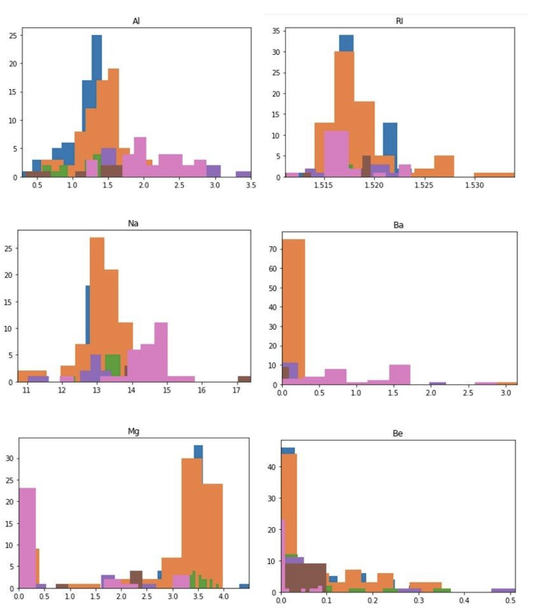
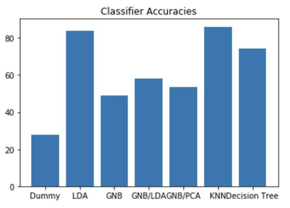

# Classification via Linear Discriminant Analysis
Team Members: Jannik Haas, Oscar Garcia

## Introduction 
Linear Discriminant Analysis (LDA) is a linear classifier and dimensionality reduction technique that attempts to find a linear combination of features that maximizes inter-class variance and minimizes intra-class variance. This technique is commonly used for predicting loans in banks and to classify images, sounds, videos and text.

The advantages of using LDA is that it is easy to implement, has a low computational cost, it can be used as an input for other classifiers and it can be used as a benchmark for more complex algorithms. Its disadvantages are that Artificial Intelligence (AI) algorithms will generally outperform it and that its performance will be affected if its assumptions are not met: having normally distributed data, equal covariances among classes and independent features.

## Dataset
The Glass Identification Data Set from the UCI machine learning repository consists of 9 predicting attributes consisting of the chemical composition of a glass and 1 target attribute which correspond to the type of glass in question, there are 7 different types of glasses:
1. Building Windows Float Processed
2. Building Windows Non Float Processed
3. Vehicle Windows Float Processed
4. Vehicle Windows Non Float Processed (none in this database)
5. Containers
6. Tableware
7. Headlamps

The classification of glasses has important applications in the field of forensic science where a glass properly identified could prove to be a piece of evidence in a criminal case. This dataset has been used researchers in the past using various techniques such as support vector machines, neural networks and genetic algorithms.
On the next figures we see a visualization of the target class distribution over the 9 predicting attributes.

## Exploratory Data Analysis 

## Implementation
The data set was split into training and test datasets using an 80% and 20% distribution. The SKLearn package was used to implement the LDA and other models for comparison. The LDA model had an 83.7% accuracy but it was beaten by the K-Nearest Neighbors (KNN) algorithm. On the next figure we see a comparison of the LDA classifier with other algorithms.

## Conclusion
The LDA algorithm performed better than many other models but was outperformed by the KNN classifier that, also is a very simple algorithm, and had a very close performance to the decision tree. The Gaussian Naive Bayes (GNB) classifier only saw a light increase in performance when its input was pre-process by the LDA and neither model had a performance over 60% meaning that using LDA as a preprocessing technique may not always result in a significant increase in performance.

## References
 C. L. Blake and C. J. Merz (1998). UCI repository of machine learning databases. University of California. [www http://www.ics.uci.edu/∼mlearn/MLRepository.html]
 
 Zhong, P. and Fukushima, M. 2007. Regularized nonsmooth Newton method for multi-class support vector machines. Optim. Methods Softw, 22: 225–236.

 Giorgio Valentini, Francesco Masulli. NEURObjects: an object-oriented library for neural network development Neurocomputing vol 48, pages 623 2002

 Juliet Juan Liu, James Tin, Yau Kwok. An Extended Genetic Rule Induction Algorithm Department of Computer Science Wuhan University
